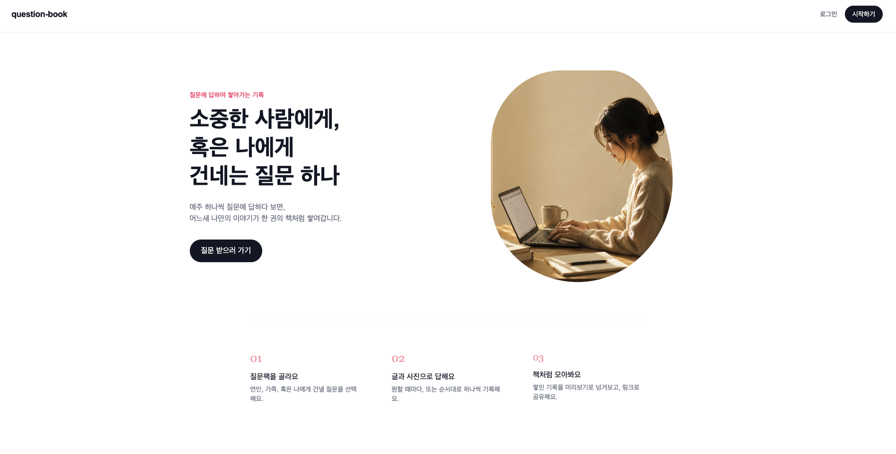

# Question-book

질문에 답하며 나 자신, 혹은 연인·가족 같은 소중한 사람에 대한 기록을 쌓아가는 서비스입니다.


## 어떤 서비스인가요

질문팩(연인에게 / 가족에게 / 나에게)을 고르거나 직접 질문을 만들어서, 하나씩 글과 사진으로 답을 남깁니다. 답이 쌓이면 책처럼 넘겨보는 미리보기 화면에서 다시 읽어볼 수 있고, 완성된 기록은 읽기 전용 링크로 소중한 사람에게 공유할 수 있습니다.

한 번 쓰고 끝나는 기능이 아니라, 답이 쌓일수록 다시 찾아올 이유가 생기는 걸 목표로 기획했습니다. 자유형(원할 때 아무 질문에나 답하기)과 주기형(정해진 간격으로 질문이 하나씩 열리는 방식) 두 가지 모드를 제공해서,  재방문을 만드는 장치를 넣었습니다.

## 실행 방법

> 이 프로젝트는 **별도 DB 설치가 필요 없습니다.** 백엔드가 H2 인메모리 DB를 내장하고 있어서, 아래 명령어 두 개만 실행하면 바로 확인할 수 있습니다.

### 사전 요구 사항

- Node 18 이상
- Java 17
- DB: 설치 불필요 (H2 인메모리, 백엔드 실행 시 자동으로 뜨고 시드 데이터도 자동으로 채워짐)

### 백엔드 (Spring Boot)

```bash
cd backend
./gradlew bootRun
```

`http://localhost:8080`에서 API 서버가 뜹니다. 실행할 때마다 `data.sql`이 자동으로 실행되어 질문팩 3종(연인에게/가족에게/나에게, 각 50문항)이 시드 데이터로 채워집니다. H2는 인메모리 DB라 서버를 껐다 켜면 이전에 만든 계정·답변 데이터는 초기화되고 시드 데이터만 다시 채워집니다.

### 프론트엔드 (Next.js)

```bash
cd frontend
npm install
npm run dev
```

`http://localhost:3000`에서 접속 가능합니다. `.env.local`에 아래 값이 필요합니다.

```
NEXT_PUBLIC_API_BASE_URL=http://localhost:8080
```

### 접속
- 로컬 URL: http://localhost:3000
- 회원가입해서 처음부터 사용해봐도 되고, 아래 시드 계정으로 바로 로그인해서 둘러봐도 됩니다.

| 구분 | 이메일 | 비밀번호 | 비고 |
|---|---|---|---|
| 관리자 | admin@questionbook.com | admin1234 | 로그인 후 `/admin`에서 전체 통계·커스텀 질문 검수 화면 확인 가능 |
| 일반 유저 | demo@questionbook.com | demo1234 | 질문북 생성부터 자유롭게 테스트 가능 |

### 초기 데이터

백엔드가 뜰 때마다 `backend/src/main/resources/data.sql`이 실행되어 질문팩 템플릿과 문항이 자동으로 채워집니다. 별도 시딩 명령 없이 바로 질문팩 선택 화면에서 확인 가능합니다.

## 만든 범위 / 뺀 범위

### 이번에 구현한 것

- 회원가입/로그인 (JWT 기반), 로그아웃 시 서버에서 토큰 즉시 무효화
- 내 질문북 목록 (한 계정으로 여러 개 만들 수 있음 — 나에게/가족에게/연인에게 등, 최대 20개)
- 질문팩 선택 및 질문 설정 (자유형/주기형 모드, 시작일)
- 질문 커스터마이징 (추가/수정/삭제, 페이지네이션, 세트당 최대 100개)
- 답변 작성/수정 (텍스트 + 사진, 사진 클릭 시 크게 보기)
- 홈/타임라인 (진행률, 질문 잠금 상태)
- 북 미리보기 (답변된 질문을 스프레드 형태로 넘겨보기)
- 공유 링크 생성/해제, 비로그인 상태로 공유 페이지 열람 (생성 후 30일 만료)
- 알림 탭 (잠금이 풀린 미답변 질문을 모아서 확인)
- 관리자 페이지 (전체 통계, 질문팩별 사용 현황, 사용자가 새로 추가한 커스텀 질문 검수)

### 기획·설계로 대체한 것 (구현하지 않음)

- **상대방 계정 기반 2인용 협업** (초대, 실시간 동시 편집): 계정 연동·동기화까지 만들면 일정상 무리라 판단해, 완성된 기록을 읽기 전용 링크로 공유하는 방식으로 단순화했습니다.
- **실제 푸시/이메일 알림**: 주기형 모드에서 다음 질문이 열리는 시점은 "시작일 + 순서×간격일" 계산으로만 처리하고, 인앱 알림 탭에서만 확인할 수 있습니다. 실제 발송(이메일/푸시)은 만들지 않았습니다.
- **질문북 최대 기간(만료일)**: 자유형은 1년, 주기형은 "간격×문항수+3개월"(1년 상한)로 계산하는 아이디어까지 생각했지만, 시간 관계상 실제 구현은 하지 못했습니다. 다음에 만들면 저장 없이 조회 시점에 계산해서 보여주는 방식으로 갈 계획입니다.

### 왜 이렇게 범위를 잘랐는지

사용자가 답을 계속 쌓아가게 만드는 핵심 흐름(질문 선택 → 답변 축적 → 다시 읽어보기 → 공유)에 시간을 집중하고, 그 흐름이 없어도 서비스가 성립하는 부가 기능은 과감히 설계 단계로만 남겼습니다. 다만 서비스가 실제로 커진다고 가정했을 때 바로 문제가 될 지점들인 무제한으로 쌓이는 질문북/질문, 로그아웃해도 죽지 않는 토큰, 기한 없이 열려 있는 공유 링크, 목록 조회 시 발생하는 N+1 쿼리는 운영 관점에서 중요하다고 판단해서 핵심 플로우를 완성한 뒤 추가로 손봤습니다. 

## 구현 vs 대체 구분 요약

| 기능                    | 상태  | 비고                             |
| --------------------- | --- | ------------------------------ |
| 회원가입/로그인(JWT)         | 구현  | OAuth·이메일 인증·비번 재설정은 제외        |
| 로그아웃 시 토큰 무효화         | 구현  | 서버 인메모리 블랙리스트 방식 (아래 기술 스택 참고) |
| 내 질문북 목록              | 구현  | 한 계정당 최대 20개                   |
| 질문팩 선택/커스터마이징         | 구현  | 추가·수정·삭제, 세트당 최대 100문항, 페이지네이션 |
| 자유형/주기형 모드            | 구현  | 잠금 여부는 날짜 계산으로만 처리             |
| 답변 작성/수정(사진 포함)       | 구현  | 로컬 파일시스템 저장                    |
| 홈/타임라인, 진행률           | 구현  |                                |
| 북 미리보기                | 구현  |                                |
| 공유 링크(읽기 전용)          | 구현  | 비로그인 접근 가능, 생성 후 30일 만료        |
| 알림 탭                  | 구현  | 잠금 풀린 미답변 질문 모아보기              |
| 관리자 페이지(통계·커스텀 질문 검수) | 구현  | role 필드 기반, 화면·API 모두 구현       |
| 목록 조회 N+1 쿼리 개선       | 구현  | 질문북 목록/알림 조회를 배치 쿼리로 전환        |
| 2인용 협업(초대, 동시 편집)     | 기획만 | 공유 링크를 통해 상대방에게 전송하는 기능으로 대체   |
| 실제 푸시/이메일 알림          | 기획만 | 인앱 알림 탭으로 대체                   |
| 질문북 만료일 자동 계산         | 기획만 | 계산식만 정하고 미구현                   |


## 기술 스택과 선택 이유

- **Frontend: Next.js (App Router, TypeScript, Tailwind CSS)** — 라우팅이 기본 제공돼서 화면 여러 개를 빠르게 붙일 수 있었고, 본인이 이미 다뤄본 스택이라 속도를 낼 수 있었습니다.
- **Backend: Spring Boot (Java, Gradle)** — 마찬가지로 익숙한 스택이라 빠르게 움직일 수 있었고, Spring Security + JWT로 최소한의 인증을 붙이기에도 무리가 없었습니다.
- **DB: H2 (인메모리)** — 별도 설치 없이 `./gradlew bootRun`만으로 심사자가 바로 재현할 수 있는 걸 가장 우선했습니다. 서버 재시작마다 시드 데이터로 깨끗하게 리셋되는 것도 데모 용도에 맞았습니다.
- **이미지 저장: 로컬 파일시스템** — 외부 스토리지 없이 동작해야 해서, 업로드된 이미지를 `uploads/` 디렉터리에 저장하고 정적 리소스로 서빙했습니다. (배포 시 무료 호스팅의 파일시스템이 재시작마다 초기화될 수 있다는 한계는 인지하고 있습니다.)
- **JWT 무효화: 서버 인메모리 블랙리스트** — JWT는 원래 서버가 상태를 들고 있지 않는 게 장점인데, 그 말은 곧 로그아웃해도 탈취된 토큰은 만료 시각까지 계속 유효하다는 뜻입니다. Redis나 별도 테이블로 완전한 토큰 관리 체계를 만들 수도 있지만, 이번 규모에서는 로그아웃 시 토큰 ID(jti)를 서버 메모리 Set에 기록해두고 요청마다 확인하는 가벼운 방식으로 충분하다고 판단했습니다. 대신 서버 재시작 시 블랙리스트도 초기화된다는 한계는 H2와 같은 성격이라 감수했습니다.

## AI 도구 사용 내역

Claude를 기획 단계부터 기획, 디버깅, 프론트 디자인, 운영 관점 점검까지 전 과정에 활용했습니다.

- **기획 단계**:  MVP 범위를 여러 차례 논의하며 판단 근거를 같이 정리했습니다.
- **프론트 구현**: Next.js 화면들과 Tailwind 스타일링을 AI와 반복적으로 주고받으며 완성했습니다.
- **디버깅**: 에러 로그와 스크린샷을 붙여넣고 원인을 찾는 데 많이 활용했습니다.
- **운영 관점 점검**: "서비스가 커지면 어떤 문제가 생길지"를 AI에게 직접 물어봐서 우선순위(로컬 이미지 저장 → N+1 쿼리 → H2 한계 → 운영/보안 부채)를 같이 정리했고, 그중 우선순위 가 높은항목(개수 제한, 로그아웃 토큰 무효화, 공유 링크 만료, N+1 쿼리)은 실제로 코드까지 반영했습니다.

### 겪었던 실패/문제

- **403인데 진짜 원인은 따로 있었던 경우**: 질문 세트 생성 API가 계속 403을 반환해서 처음엔 JWT 인증 문제로 의심했는데, 실제로는 컨트롤러 내부에서 예외가 나서 `/error`로 포워딩된 요청이 `permitAll`에 안 걸려 있어 403으로 위장된 것이었습니다. Security 디버그 로그를 켜서 요청 흐름을 하나씩 따라가서야 진짜 원인(404, 별개의 매핑 문제)을 찾을 수 있었습니다.
- **타임존 버그**: 프론트에서 오늘 날짜를 `new Date().toISOString()`으로 구했더니, 한국 시간 새벽~오전 시간대에는 UTC 기준 전날 날짜가 나오는 버그가 있었습니다. AI가 처음 제안한 코드에 이 문제가 있었고, 로컬 시간 기준으로 직접 년/월/일을 조합하는 방식으로 고쳤습니다.


## API 개요

| 메서드    | 경로                                  | 설명                          | 인증  |
| ------ | ----------------------------------- | --------------------------- | --- |
| POST   | /api/auth/signup                    | 회원가입                        | -   |
| POST   | /api/auth/login                     | 로그인                         | -   |
| POST   | /api/auth/logout                    | 로그아웃 (서버 토큰 무효화)            | 필요  |
| GET    | /api/question-pack-templates        | 질문팩 템플릿 목록                  | -   |
| GET    | /api/question-pack-templates/{id}   | 템플릿 상세(기본 질문 포함)            | -   |
| GET    | /api/question-sets                  | 내 질문북 목록                    | 필요  |
| POST   | /api/question-sets                  | 질문 세트 생성 (최대 20개 제한)        | 필요  |
| GET    | /api/question-sets/{id}             | 질문 세트 조회(질문+잠금+답변 여부)       | 필요  |
| GET    | /api/question-sets/{id}/progress    | 진행률 조회                      | 필요  |
| GET    | /api/question-sets/{id}/preview     | 북 미리보기(답변된 질문만)             | 필요  |
| POST   | /api/question-sets/{id}/questions   | 질문 추가 (세트당 최대 100개 제한)      | 필요  |
| PATCH  | /api/questions/{id}                 | 질문 수정                       | 필요  |
| DELETE | /api/questions/{id}                 | 질문 삭제                       | 필요  |
| GET    | /api/questions/{id}/answer          | 답변 조회                       | 필요  |
| POST   | /api/questions/{id}/answer          | 답변 작성/수정(멀티파트, 텍스트+이미지)     | 필요  |
| POST   | /api/question-sets/{id}/share-links | 공유 링크 생성 (30일 만료)           | 필요  |
| DELETE | /api/share-links/{id}               | 공유 링크 비활성화                  | 필요  |
| GET    | /api/share/{token}                  | 공유 링크로 읽기 전용 조회             | 불필요 |
| GET    | /api/notifications                  | 잠금 풀린 미답변 질문 목록             | 필요  |
| GET    | /api/admin/stats                    | 전체 통계(가입자, 완료율, 질문팩별 사용 현황) | 관리자 |
| GET    | /api/admin/custom-questions         | 사용자가 추가한 커스텀 질문 목록          | 관리자 |

## 유의사항

- 이미지 업로드는 로컬 `uploads/` 디렉터리에 저장되며 `.gitignore`에 등록돼 있습니다.
- H2가 인메모리 DB이고 로그아웃 토큰 블랙리스트도 서버 메모리에 저장되는 방식이라, **백엔드를 재시작하면 계정·답변·공유 링크·블랙리스트가 모두 초기화**됩니다. 
